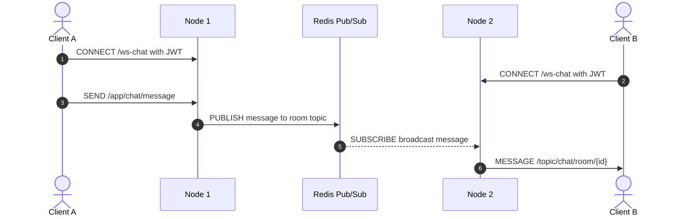
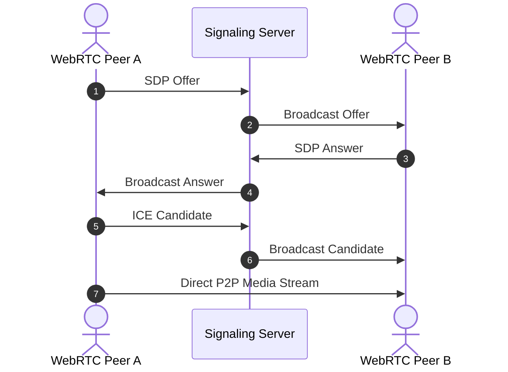

<div align="center">


<h3>📡 Enterprise Realtime Messaging, WebSocket Scale-out, and WebRTC Signaling Lab</h3>

<p>
  
  
  
  
</p>

<p>
  
  
  
</p>

</div>

---

> WebSocket scale-out, STOMP handshake security, WebRTC signaling을 하나의 실시간 통신 아키텍처로 검증하는 엔터프라이즈 레퍼런스입니다.  
> 단일 서버 채팅 예제를 넘어, 다중 노드 환경의 메시지 동기화와 P2P 미디어 연결 수립 흐름을 코드와 테스트로 증명합니다.

---

## 📌 Problem — 왜 만들었는가

- **WebSocket scale-out 한계**: 단일 서버 메모리 기반 메시징은 서버가 늘어날수록 세션과 메시지 동기화 문제가 발생합니다.
- **실시간 연결 인증 복잡성**: WebSocket/STOMP 연결은 일반 HTTP 요청과 다르게 별도 handshake 인증 전략이 필요합니다.
- **WebRTC 서버 부하 문제**: 화상/음성 미디어 트래픽을 서버가 직접 중계하면 비용과 지연 시간이 커집니다.
- **시간 데이터 신뢰성**: 클라이언트가 보낸 timestamp를 그대로 믿으면 메시지 정렬과 감사 로그가 왜곡될 수 있습니다.

Realtime Comm Lab은 Redis Pub/Sub 기반 분산 채팅, JWT STOMP handshake interceptor, WebRTC P2P signaling을 통해 실시간 시스템의 확장성과 연결 보안을 함께 다룹니다.

## 🏗️ Architecture — 어떻게 설계했는가

### STOMP & Redis Pub/Sub Architecture



### WebRTC P2P Signaling Architecture



## 📂 Project Structure

```text
realtime-comm-lab/
├── .github/workflows/                         # ⚙️ CI/CD 자동화 파이프라인
├── src/main/java/com/hooney/lab/realtime/
│   ├── chat/                                  # 💬 STOMP 기반 분산 채팅 도메인
│   │   ├── controller/                        # 🌐 메시지 라우팅 및 서버 timestamp 보정
│   │   ├── dto/                               # 📦 채팅 요청/응답 메시지 모델
│   │   └── pubsub/                            # 📡 Redis Publisher/Subscriber 연동
│   ├── config/                                # ⚙️ WebSocket, STOMP, Redis 설정
│   ├── security/                              # 🛡️ JWT handshake 인증 인터셉터
│   └── webrtc/                                # 🎥 P2P 화상 통신 signaling 도메인
├── src/test/java/com/hooney/lab/realtime/
│   ├── chat/                                  # 🧪 Embedded Redis 기반 pub/sub 통합 테스트
│   └── security/                              # 🧪 STOMP CONNECT 인증 실패/성공 테스트
├── build.gradle                               # 🧰 Spring Boot, Redis, WebSocket 의존성
├── docker-compose.yml                         # 🐳 Redis + 다중 App Node scale-out 시뮬레이션
└── Dockerfile                                 # 📦 컨테이너 이미지 빌드 정의
```

## 🎯 Key Features & Evidence — 무엇을 증명하는가

### 1. Redis Pub/Sub 기반 Scale-out Messaging

| Feature | Description |
| :--- | :--- |
| **Multi-node Broadcast** | 여러 애플리케이션 노드가 Redis topic을 통해 같은 채팅방 메시지를 공유 |
| **Server-side Timestamp** | 클라이언트 시간 위조를 방지하기 위해 서버 인입 시점 기준으로 시간 보정 |
| **Embedded Redis Test** | 로컬 Redis 없이도 분산 메시징 흐름을 검증 |

**Evidence**

- `ChatMessagePublisher`와 `RedisMessageSubscriber`로 노드 간 메시지 전파를 구현합니다.
- Embedded Redis 기반 통합 테스트로 publish/subscribe 흐름을 검증합니다.
- 단일 `SimpleBroker` 구조에서 발생하는 노드 간 메시지 불일치 문제를 Redis broker로 해결합니다.

### 2. WebRTC P2P Signaling Server

| Signal | Role |
| :--- | :--- |
| **OFFER** | 연결을 시작하는 Peer의 미디어 세션 제안 |
| **ANSWER** | 상대 Peer의 미디어 세션 응답 |
| **ICE Candidate** | 네트워크 경로 탐색을 위한 후보 정보 교환 |

**Evidence**

- `WebRTCSignalingController`가 미디어 트래픽을 직접 처리하지 않고 signaling 정보만 중계합니다.
- 연결 수립 후 미디어는 Peer 간 직접 흐르도록 하여 서버 부하를 줄입니다.

### 3. JWT Handshake Interceptor

| Risk | Strategy | Evidence |
| :--- | :--- | :--- |
| 비인가 WebSocket 연결 | STOMP CONNECT 단계에서 JWT 검증 | `JwtChannelInterceptor` |
| HTTP 필터 우회 | WebSocket 전용 인증 흐름 분리 | Interceptor unit test |
| 리소스 선점 공격 | 연결 초기에 인증 실패 처리 | Handshake failure scenario |

**Evidence**

- 최초 연결 시점에 JWT를 검증하여 비인가 클라이언트의 세션 생성을 차단합니다.
- HTTP API 인증과 WebSocket 인증을 분리해 프로토콜 차이를 명확히 처리합니다.

## 🚀 Quick Start — 어떻게 실행하는가

### 로컬 개발 환경

```bash
git clone https://github.com/hooneyg/realtime-comm-lab.git
cd realtime-comm-lab

./gradlew test
./gradlew bootRun
```

### Docker Multi-node 시뮬레이션

```bash
docker-compose up -d --build
docker-compose logs -f
```

## 🧪 Tests — 어떻게 검증했는가

```bash
./gradlew test
```

| Test Target | What It Proves |
| :--- | :--- |
| Redis Pub/Sub integration | 노드 간 메시지 전파와 구독 흐름 |
| WebRTC signaling controller | Offer, Answer, ICE Candidate 라우팅 |
| JWT channel interceptor | 토큰 누락, 만료, 위조 연결 차단 |
| GitHub Actions CI | push마다 테스트와 빌드 자동 검증 |

## 🧭 Roadmap

- [ ] WebSocket session registry 고도화
- [ ] Redis Streams 적용 검토
- [ ] WebRTC room/session lifecycle 관리
- [ ] Connection metrics 수집
- [ ] Load test 시나리오 추가

## 🔗 Related Labs

| Related Lab | 연결 이유 |
| :--- | :--- |
| `security-auth-core` | WebSocket과 signaling 요청의 인증/인가 기준 |
| `infra-master-lab` | 다중 노드 실시간 서버 배포와 운영 기준 |
| `database-master-lab` | 채팅방, 메시지, 세션 상태 저장 기준 |
| `event-streaming-lab` | 실시간 이벤트와 비동기 메시지 처리 기준 |
| `ai-agent-brain-lab` | 사용자와 AI Agent 간 실시간 대화 채널 확장 |

## 📚 Documentation

- [WebSocket Scaling Strategy](./docs/websocket-scaling.md)
- [Redis Pub/Sub Clustering](./docs/redis-pubsub-clustering.md)
- [WebRTC Signaling Flow](./docs/webrtc-signaling-flow.md)
- [JWT Handshake Auth](./docs/jwt-handshake-auth.md)
- [Troubleshooting Guide](./docs/troubleshooting.md)

## 📄 License

This project is licensed under the [MIT License](./LICENSE).

---

<div align="center">
<b>Built by <a href="https://github.com/hooneyg">Hooney</a> — AI FullStack Developer & Enterprise Solution Architect</b>


</div>
