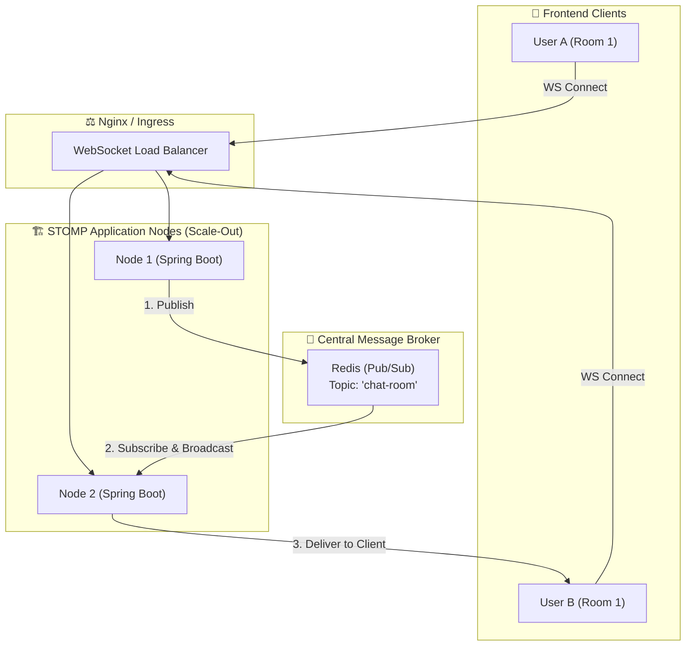

  

# 📡 Realtime Comm Lab: 엔터프라이즈 실시간 분산 아키텍처

  
  
<i>"Zero-Latency, Absolute Reliability in Scale-out Environments"</i>

  
  
  
  

---

## 🏗️ 1. Project Essence (프로젝트 핵심 가치)
**Realtime Comm Lab**은 단순한 로컬 웹소켓 서버를 넘어, 서버가 수십 대로 늘어나는(Scale-out) 대규모 트래픽 환경에서도 **메시지 유실 없이 실시간 통신을 보장**하는 엔터프라이즈 아키텍처 레퍼런스입니다. 
Redis Pub/Sub을 활용한 분산 메시징 브로커와, P2P 화상 통신을 중계하는 WebRTC 시그널링 서버가 하나의 생태계로 통합되어 있습니다.

---

## 🌐 2. Scale-out Architecture (아키텍처 조감도)

이 도식은 여러 대의 STOMP 서버 인스턴스가 중앙의 Redis를 통해 실시간 트래픽을 완벽하게 브로드캐스팅하는 흐름을 보여줍니다.

---

## 🛡️ 3. 핵심 기술 및 구현 포인트 (Key Features)

### 1. Redis Pub/Sub 기반 스케일 아웃 (Chat Domain)
- 단일 서버의 메모리에 의존하는 `SimpleBroker`의 한계를 극복했습니다.
- `ChatMessagePublisher`와 `RedisMessageSubscriber`를 구현하여, 노드 간 완벽한 메시지 동기화를 달성했습니다.
- 클라이언트 시간 위조 방지를 위해 서버 인입 시 타임스탬프를 보정합니다.

### 2. WebRTC P2P 시그널링 서버 (WebRTC Domain)
- 클라이언트 간 직접 미디어 통신을 위한 `OFFER`, `ANSWER`, `ICE Candidate` 교환을 고속으로 중계하는 `WebRTCSignalingController`를 구현했습니다.
- 서버의 리소스 부하를 0에 수렴시키는 P2P 통신의 핵심 뼈대입니다.

### 3. JWT Handshake Interceptor (Security)
- HTTP 세션이 아닌 STOMP 프로토콜에 맞춘 특수 인증 로직입니다.
- `JwtChannelInterceptor`를 통해 소켓 최초 연결(`CONNECT`) 시 헤더를 검사하고, 비인가 접속을 원천 차단하여 인프라 자원을 보호합니다.

---

## 🧪 4. 검증 및 CI/CD 파이프라인

이 프로젝트는 100% 무인 검증 및 배포 파이프라인을 갖추고 있습니다.

- **통합 검증 (`EmbeddedRedis`)**: 포트 충돌 없이 프로세스 메모리 내에서 Redis를 기동시켜 Pub/Sub 송수신 로직을 완벽히 검증하는 `PubSubIntegrationTest`를 구축했습니다.
- **Docker Multi-Stage Build**: `Dockerfile`을 통해 `gradle:jdk21` 환경에서 소스 코드를 빌드하고, JRE 경량 이미지로 패키징하여 이미지 크기를 최소화했습니다.
- **GitHub Actions**: 코드 푸시 시 빌드/테스트를 수행하는 `ci.yml`과, Docker Hub에 이미지를 자동 배포하는 `docker.yml` 워크플로우를 완벽하게 연동했습니다.

---

  

