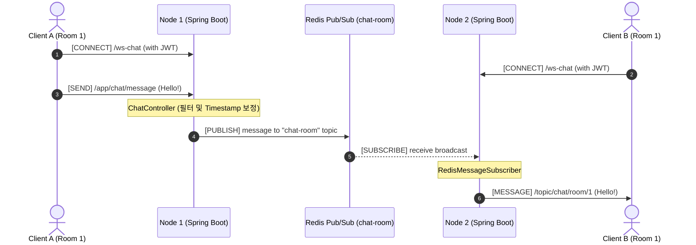

<div align="center">
  
</div>

# 📡 Realtime Comm Lab: 엔터프라이즈 실시간 분산 아키텍처

<div align="center">
  
  <p><i>"Zero-Latency, Absolute Reliability in Scale-out Environments"</i></p>

  [](https://spring.io/projects/spring-boot)
  [](https://openjdk.org/projects/jdk/21/)
  [](https://redis.io/)
  [](https://webrtc.org/)
  [](https://opensource.org/licenses/MIT)
</div>

---

## 🏗️ 1. Project Essence (프로젝트 핵심 가치)
**Realtime Comm Lab**은 단순한 단일 서버 웹소켓 장난감을 넘어, 서버가 수십 대로 늘어나는(Scale-out) 환경에서도 **메시지 유실 없이 통신을 보장**하는 엔터프라이즈 레퍼런스입니다. 
본 프로젝트는 **1) Redis Pub/Sub 기반 분산 채팅**과 **2) WebRTC P2P 화상 통신 시그널링** 두 가지 핵심 도메인을 완벽하게 분리하여 설계했습니다.

---

## 🌐 2. Architecture Blueprints (아키텍처 조감도)

### 2.1. STOMP & Redis Pub/Sub Architecture (Chat Domain)
여러 대의 STOMP 서버 인스턴스가 중앙의 Redis를 통해 실시간 트래픽을 완벽하게 브로드캐스팅하는 흐름입니다.



### 2.2. WebRTC P2P Signaling Architecture (WebRTC Domain)
서버 부하를 0에 수렴시키는 P2P 화상 통신의 초기 연결 수립(Handshake)을 돕는 전화 교환기(Signaling) 흐름입니다.

```mermaid
sequenceDiagram
    autonumber
    actor PeerA as WebRTC Peer A
    participant SigServer as Signaling Controller
    actor PeerB as WebRTC Peer B

    PeerA->>SigServer: [SEND] /app/rtc/signal (SDP OFFER)
    SigServer->>PeerB: [BROADCAST] /topic/rtc/room/1 (SDP OFFER)
    
    PeerB->>SigServer: [SEND] /app/rtc/signal (SDP ANSWER)
    SigServer->>PeerA: [BROADCAST] /topic/rtc/room/1 (SDP ANSWER)
    
    PeerA->>SigServer: [SEND] /app/rtc/signal (ICE Candidate)
    SigServer->>PeerB: [BROADCAST] /topic/rtc/room/1 (ICE Candidate)
    
    Note over PeerA, PeerB: WebRTC P2P 연결 수립! (서버 개입 없음)
    PeerA<-->>PeerB: 직접 미디어(Video/Audio) 스트리밍 시작
```

---

## 🛡️ 3. 핵심 기술 및 구현 포인트 (Key Features)

### 3.1. Redis Pub/Sub 기반 스케일 아웃
- 단일 서버의 메모리에 의존하는 `SimpleBroker`의 한계를 극복했습니다.
- `ChatMessagePublisher`와 `RedisMessageSubscriber`를 구현하여, 노드 간 완벽한 메시지 동기화를 달성했습니다.
- 클라이언트 시간 위조 방지를 위해 서버 인입 시 타임스탬프를 보정합니다.

### 3.2. WebRTC P2P 시그널링 서버
- 클라이언트 간 직접 미디어 통신을 위한 `OFFER`, `ANSWER`, `ICE Candidate` 교환을 고속으로 중계하는 `WebRTCSignalingController`를 구현했습니다.

### 3.3. JWT Handshake Interceptor
- HTTP 세션이 아닌 STOMP 프로토콜에 맞춘 특수 인증 로직입니다.
- `JwtChannelInterceptor`를 통해 소켓 최초 연결(`CONNECT`) 시 헤더를 검사하고, 비인가 접속을 원천 차단하여 인프라 자원을 보호합니다.

---

## ⚙️ 4. Build & Test Instructions (빌드 및 테스트 가이드)

### 4.1. 로컬 환경 테스트 (Local Development)
가장 빠르게 통합 테스트를 검증하는 방법입니다. (`EmbeddedRedis` 내장)
```bash
# 1. 깃허브에서 클론
git clone https://github.com/hooneyg/realtime-comm-lab.git
cd realtime-comm-lab

# 2. 통합 검증 및 단위 테스트 실행 (Mocking & EmbeddedRedis)
./gradlew test

# 3. 로컬 서버 부트
./gradlew bootRun
```

### 4.2. Docker Multi-Node 시뮬레이션 (Scale-out Test)
로컬에 Java나 Gradle이 없어도 완벽한 분산 서버 환경을 띄울 수 있습니다.
```bash
# Redis 브로커 1대와 Application 서버 2대를 동시에 실행 (로드밸런싱 검증용)
docker-compose up -d --build

# 서버 상태 확인
docker-compose logs -f
```

### 4.3. GitHub Actions CI/CD
본 레포지토리는 다음과 같은 자동화 파이프라인을 포함합니다:
- **`.github/workflows/ci.yml`**: 코드 Push 시 `gradle:jdk21-alpine` 컨테이너 내에서 단위 및 통합 테스트 자동 수행.
- **`.github/workflows/docker.yml`**: Main 브랜치 병합 시 Multi-stage `Dockerfile`을 빌드하여 초경량 JRE 이미지를 Docker Hub로 배포.

---

<div align="center">
  
</div>
