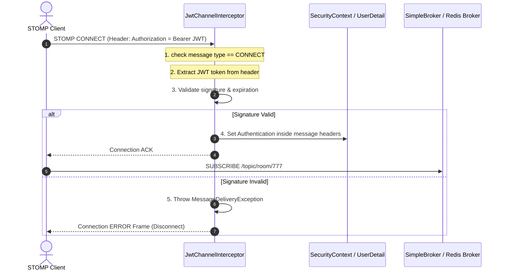

# 🔐 JWT Handshake Auth (웹소켓 JWT 핸드셰이크 인증)

이 문서는 `realtime-comm-lab`에서 STOMP WebSocket 연결 수립(Handshake) 과정에서 사용자 신원(User Identity)을 확인하고 비인가 사용자의 세션 선점을 원천 차단하기 위한 **인터셉터(Interceptor) 기반 JWT 검증 설계**를 다룹니다.

---

## 📌 1. HTTP Security와 WebSocket Security의 차이

전통적인 REST API 환경에서는 매 HTTP 요청마다 `OncePerRequestFilter` 등을 상속한 필터가 작동하여 헤더의 `Authorization: Bearer <JWT>`를 가로채 보안 컨텍스트(Security Context)를 설정합니다.

그러나 웹소켓(WebSocket) 및 STOMP 프로토콜은 최초 연결(Handshake) 시점에만 HTTP Upgraded 요청을 거치고, 이후에는 하나의 TCP 커넥션을 지속적으로 재사용하여 STOMP 프레임(`CONNECT`, `SUBSCRIBE`, `SEND`, `DISCONNECT`) 단위로 실시간 패킷을 교환합니다.
- **필터 무력화**: 최초 업그레이드 이후의 STOMP 프레임은 서블릿 필터(Servlet Filter) 계층을 타지 않으므로 일반적인 Spring Security Filter Chain 방식으로 인가 통제를 처리할 수 없습니다.
- **보안 위협**: 인증되지 않은 클라이언트가 프레임을 무단 송신하거나 임의의 방(Topic)을 구독하여 타인의 개인 메시지를 도청할 위험이 있습니다.

---

## 🏗️ 2. STOMP 채널 인터셉터 구현 (JwtChannelInterceptor)

본 랩(Lab)은 스프링 메시징 시스템의 내부 채널에 **`ChannelInterceptor`**를 등록하여 웹소켓 세션 인입 보안을 제어합니다.

### ⚙️ 핵심 구현 논리 (Core Logic)
1. **타입 식별**: 들어오는 STOMP 메시지의 커맨드가 `SimpMessageType.CONNECT`인지 확인합니다.
2. **토큰 파싱**: `nativeHeaders` 맵에서 `Authorization` 키를 조회하여 `Bearer ` 접두사를 파싱합니다.
3. **서명 및 만료 검증**: JWT 라이브러리를 통해 서명이 올바른지, 만료 시간(`Expiration`)이 지나지 않았는지 체크합니다.
4. **인증 객체 바인딩**: 검증이 성공하면 Spring Security의 `UsernamePasswordAuthenticationToken`을 생성하고, 메시지 헤더의 `SimpMessageHeaderAccessor.USER_HEADER`에 바인딩하여 세션 라이프사이클(Lifecycle) 동안 사용자 정보를 기억하게 합니다.
5. **차단 및 에러 프레임**: 토큰이 올바르지 않으면 `MessageDeliveryException`을 발생시켜 연결을 즉시 중단하고 클라이언트에게 `ERROR` 프레임을 반환합니다.

---

## 🧭 3. 예외 처리 및 보안 고려사항 (Edge Cases)

- **`CONNECT` 시점 강제**: `SUBSCRIBE` 나 `SEND` 프레임이 유입될 때마다 JWT를 파싱하고 검증하는 것은 높은 CPU 연산 오버헤드를 유발하므로, 최초 `CONNECT` 시점에 한 번만 철저히 인증한 뒤 생성된 세션 내부 세션 컨텍스트를 재사용합니다.
- **CSRF 방어**: 브라우저 기반 WebSocket 클라이언트는 CSRF 공격의 표적이 될 수 있으므로, 쿠키 인증 방식이 아닌 메시지 핸드셰이크 헤더에 포함된 명시적 JWT 전달 방식을 사용함으로써 위변조 공격 리스크를 최소화합니다.
