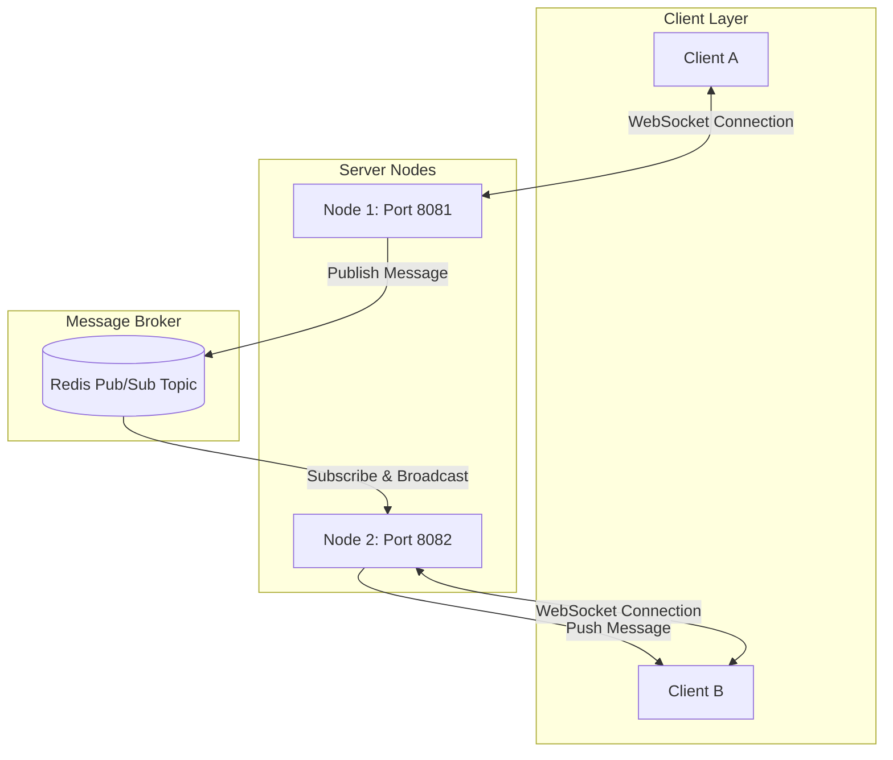

# 📡 WebSocket Scaling Strategy (웹소켓 스케일아웃 전략)

이 문서는 `realtime-comm-lab`에서 다중 노드(Multi-node) 서버 분산 환경에서 실시간 연결성(Realtime Connectivity)을 보장하고 웹소켓(WebSocket) 세션을 수평 확장(Scale-out)하기 위한 설계 및 아키텍처(Architecture) 전략을 다룹니다.

---

## 📌 1. 분산 환경에서의 웹소켓 한계 (The Problem)

전통적인 HTTP API 서버는 상태를 가지지 않는(Stateless) 아키텍처를 취하므로 로드 밸런서(Load Balancer)를 통해 노드를 자유롭게 확장할 수 있습니다. 그러나 웹소켓(WebSocket) 프로토콜은 지속적인 연결(Persistent Connection)을 유지하는 상태 지향형(Stateful) 연결입니다. 

이로 인해 다음과 같은 **세션 불일치(Session Discrepancy)** 문제가 발생합니다:
1. **세션 바인딩(Session Binding)**: 클라이언트 A는 `서버 1(Node 1)`에 연결되어 있고, 클라이언트 B는 `서버 2(Node 2)`에 연결되어 있는 경우.
2. **라우팅 실패(Routing Failure)**: 클라이언트 A가 보낸 메시지가 `서버 1`에 인입되었을 때, `서버 1`은 자신에게 직접 웹소켓 세션이 붙어있지 않은 클라이언트 B에게 메시지를 직접 푸시(Push)할 방법이 없습니다.

---

## 🏗️ 2. Redis Pub/Sub 기반 메시지 브로커 통합 (Solution)

이 문제를 해결하기 위해 본 랩(Lab)에서는 인메모리(In-memory) 메시지 브로커인 **Redis Pub/Sub**을 릴레이(Relay) 계층으로 도입했습니다.

### 🔄 실시간 메시지 동기화 시퀀스 (Flow)
1. **메시지 송신**: `서버 1`에 세션이 연결된 `Client A`가 채팅방 `/app/chat/message` 경로로 메시지를 전송합니다.
2. **이벤트 발행(Publish)**: `서버 1`은 비즈니스 로직(서버 시간 보정 등)을 처리한 후, 지정된 Redis 토픽(예: `chat:room:777`)으로 메시지를 발행(Publish)합니다.
3. **이벤트 전파(Broadcast)**: 동일한 Redis 토픽을 구독(Subscribe)하고 있는 모든 애플리케이션 노드(`서버 1`, `서버 2` 등)가 메시지를 동보 수신합니다.
4. **최종 클라이언트 푸시**: 수신된 메시지를 바탕으로, 대상 채팅방에 가입(구독)된 웹소켓 세션(`Client B`)이 존재하는 `서버 2`가 메모리 상의 웹소켓 커넥션을 찾아 `Client B`에게 최종 메시지를 스트리밍(Streaming)합니다.

---

## ⚙️ 3. 스프링 부트 설정 및 연동 구조 (Spring Boot Configuration)

스프링 부트(Spring Boot)의 STOMP 설정에서 SimpleBroker 대신 Redis 외부 브로커 기능을 바인딩하거나, 본 프로젝트와 같이 **`MessageListenerAdapter`**와 **`RedisMessageListenerContainer`**를 사용하여 로컬의 웹소켓 클라이언트 세션에 메시지를 수동 포워딩하도록 설계할 수 있습니다.

- **`ChatMessagePublisher`**: 클라이언트로부터 인입된 메시지를 감지하여 `redisTemplate.convertAndSend()` 호출을 수행합니다.
- **`RedisMessageSubscriber`**: Redis로부터 메시지가 유입되면 `SimpMessagingTemplate.convertAndSend()`를 호출하여 대상 노드에 붙어있는 클라이언트 세션들에게 메시지를 전달합니다.

이 방식을 통해 노드가 무수히 늘어나더라도 단일 메모리에 웹소켓 세션 정보가 귀속되는 한계를 극복하고 수평적 확장이 가능해집니다.
