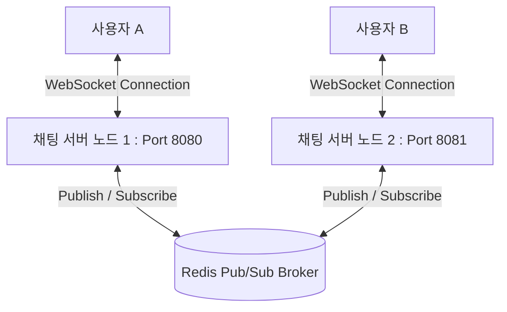

# 🌐 Realtime Comm Lab 시나리오 및 검증 가이드

이 문서는 `realtime-comm-lab` 프로젝트의 핵심 아키텍처인 **Redis Pub/Sub 기반 다중 노드 실시간 동기화**와 **Live Tester**를 활용한 웹소켓(WebSocket) 통신 시나리오 및 검증 방법을 설명합니다.

---

## 🏗️ 다중 노드 실시간 동기화 아키텍처 (Multi-Node Sync Architecture)

단일 웹소켓(WebSocket) 서버 구조에서는 서버 메모리에 접속 세션(Session)을 관리하므로, 동일한 서버에 접속한 사용자끼리만 메시지를 주고받을 수 있습니다. 그러나 대규모 트래픽 처리를 위해 서버를 가로로 확장(Scale-out)하여 다중 노드로 운영할 경우, 서로 다른 서버 노드에 접속한 사용자 간에는 메시지가 전달되지 않는 **세션 불일치 문제**가 발생합니다.

이를 해결하기 위해 본 프로젝트에서는 **인메모리 데이터 저장소(In-memory Data Store)**인 레디스(Redis)의 **발행/구독(Pub/Sub) 모델**을 메시지 브로커(Message Broker)로 도입하였습니다.



### 🔁 메시지 전송 및 동기화 흐름 (Message Flow)
1. **발행(Publish):** 사용자 A가 `서버 노드 1`에 메시지를 전송하면, `서버 노드 1`은 해당 메시지를 데이터베이스에 저장한 후 Redis의 특정 채널(예: `chat-room-topic`)로 메시지를 발행(Publish)합니다.
2. **구독(Subscribe):** `서버 노드 1`과 `서버 노드 2`를 포함한 모든 클러스터 노드는 구동 시점에 Redis 채널을 구독(Subscribe)하고 있습니다.
3. **브로드캐스트(Broadcast):** Redis를 통해 메시지를 수신한 각 서버 노드는 현재 자신에게 웹소켓으로 연결된 클라이언트 중 해당 채팅방에 참여 중인 세션들을 찾아 메시지를 브로드캐스트(Broadcast)합니다. 이로써 사용자 B는 `서버 노드 2`에 접속해 있음에도 사용자 A의 메시지를 실시간으로 수신하게 됩니다.

---

## 🧪 Live Tester를 활용한 실시간 통신 검증 시나리오

프로젝트 내에 내장된 Live Tester 템플릿([index.html](file:///d:/works/20260513/realtime-comm-lab/src/main/resources/static/index.html))을 활용하여 다중 노드 환경을 모사하고 실시간 통신 및 장애 내성(Fault Tolerance)을 직접 검증할 수 있습니다.

### 시나리오 1: 단일 노드 기본 실시간 채팅 테스트
1. `docker-compose.yml`을 활용하여 Redis와 스프링 부트 애플리케이션을 실행합니다.
2. 브라우저 창을 두 개 열어 다음 주소로 접속합니다.
   - 클라이언트 1: `http://localhost:8080` (사용자명: UserA, 방 번호: Room1)
   - 클라이언트 2: `http://localhost:8080` (사용자명: UserB, 방 번호: Room1)
3. UserA가 메시지를 전송했을 때, UserB의 화면에 즉각적으로 실시간 반영되는지 확인합니다.
4. 방 번호를 Room2로 다르게 접속한 클라이언트에게는 메시지가 가지 않는지 격리 테스트(Isolation Test)를 수행합니다.

### 시나리오 2: Redis Pub/Sub을 통한 다중 노드 동기화 테스트
1. 로컬 환경에서 포트를 달리하여 두 개의 애플리케이션 프로세스를 띄웁니다 (Port 8080 및 8081).
2. 브라우저에서 각각 다른 서버 노드로 접속합니다.
   - 클라이언트 1: `http://localhost:8080` (사용자명: UserA, 방 번호: SharedRoom)
   - 클라이언트 2: `http://localhost:8081` (사용자명: UserB, 방 번호: SharedRoom)
3. UserA가 메시지를 보내면, Redis Pub/Sub 브릿지를 거쳐 8081 포트의 UserB에게 실시간으로 전달되는지 로그와 화면을 통해 검증합니다.

---

## 🛠️ 검증용 로컬 실행 및 모니터링 방법

### 1. 환경 실행 (Docker Compose)
Redis 컨테이너를 구동하여 Pub/Sub 브로커를 활성화합니다.
```bash
docker-compose up -d redis
```

### 2. Redis Pub/Sub 실시간 이벤트 모니터링
실제 Redis 채널로 메시지가 발행되는지 CLI를 통해 직접 관찰할 수 있습니다.
```bash
docker exec -it <redis-container-id> redis-cli
127.0.0.1:6379> PSUBSCRIBE *
```
- 웹 화면에서 메시지를 보낼 때마다 Redis CLI 터미널에 메시지 페이로드와 채널명이 실시간 출력되는지 대조합니다.
